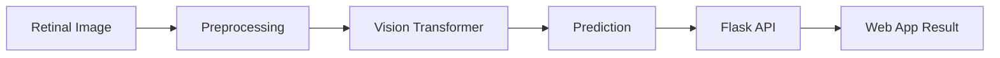

 

  

  

---

## 🧑‍💻 Who Am I?

| | |
|---|---|
| 👤 **Name** | Arivazhagan M |
| 📍 **Location** | Chennai, Tamil Nadu |
| 🎓 **Education** | B.Tech Information Technology — CGPA 7.6 / 10 |
| 🔬 **Research** | Presenter at ICICCS 2026 |
| 🎯 **Roles** | Python • Backend • Full Stack • AI/ML • Frontend |

I'm an **Information Technology graduate** who builds practical software with **Python, Flask, JavaScript, databases and AI/ML** — from interface design to backend logic to deploying AI models inside usable applications.

**What I build:** 🤖 AI web apps · 🐍 Flask apps · 🌐 responsive frontends · 🧠 computer vision · 🗄️ database-driven systems · 🛒 e-commerce · ⚙️ CRUD & OOP apps

---

## 🧬 Tech Universe

---

## 🤖 AI / ML Pipeline

---

## 🚀 Featured Projects

<table>
<tr>
<td width="50%" valign="top">

### 👁️ Glauco Vision
**Early glaucoma detection with a Vision Transformer**

Flask web app for retinal-image screening.

- 📷 Retinal image upload
- 🧠 ViT analysis & automated prediction
- 📊 Result display, responsive UI

`Python` `Flask` `ViT` `HTML` `CSS` `JS`

🏆 Presented at **ICICCS 2026**

[🔗 Repository](https://github.com/Arivu-2005/glucovision)

</td>
<td width="50%" valign="top">

### 🌱 Mann-Vaasam
**Farm-to-home e-commerce platform**

Responsive store connecting customers with farm products.

- 🛒 Product presentation
- 💬 WhatsApp ordering
- 🗄️ MongoDB integration

`HTML5` `CSS3` `JavaScript` `MongoDB`

[🔗 Repository](https://github.com/Arivu-2005/mann-vaasam) · [🌐 Live](https://arivu-2005.github.io/mann-vaasam/)

</td>
</tr>
<tr>
<td width="50%" valign="top">

### 👥 Employee Management System
**Employee records with OOP + CRUD**

`Create → Read → Update → Delete`

`Python` `OOP` `CRUD`

[🔗 Repository](https://github.com/Arivu-2005/employee-management-system) · [🌐 Live](https://arivu-2005.github.io/employee-management-system/)

</td>
<td width="50%" valign="top">

### 🏦 SecureBank ATM Simulator
**Console banking simulation**

- 🔐 PIN authentication
- 💰 Balance · 💸 Withdraw · 💵 Deposit
- 🧾 Transaction handling

`Python` `OOP`

[🔗 Repository](https://github.com/Arivu-2005/securebank-atm-simulator) · [🌐 Live](https://arivu-2005.github.io/securebank-atm-simulator/)

</td>
</tr>
</table>

---

## 💼 Experience

**Frontend Developer Intern — Vita Rail Services Pvt. Ltd.** · 📍 Chennai

- Built responsive pages with HTML, CSS, JavaScript and Bootstrap
- Improved UI quality, responsiveness and usability
- Assisted with testing and debugging

---

## 🏆 Achievements

| | Achievement |
|---|---|
| 🔬 | Glauco Vision research presented at **ICICCS 2026** |
| 🤖 | Built a Vision Transformer–based retinal screening app |
| 💻 | Frontend Developer Intern at Vita Rail Services |
| 🎓 | B.Tech IT — CGPA 7.6/10 |
| 🚀 | Shipped projects across AI, e-commerce and Python systems |

---

## 📚 Currently Learning

---

## 🎯 Open To

🐍 Python Developer · ⚙️ Backend Developer · 💻 Software Engineer · 🌐 Full Stack Developer · 🤖 AI/ML Engineer · 🎨 Frontend Developer

---

## 📊 GitHub Analytics

---

## 🔗 Connect

### ⚡ BUILD • LEARN • SHIP • REPEAT
*Turning ideas into intelligent software.*

